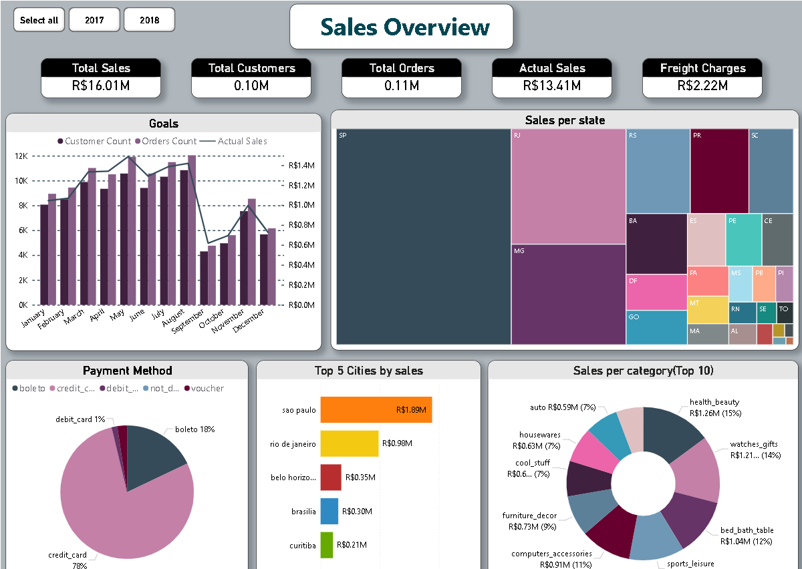
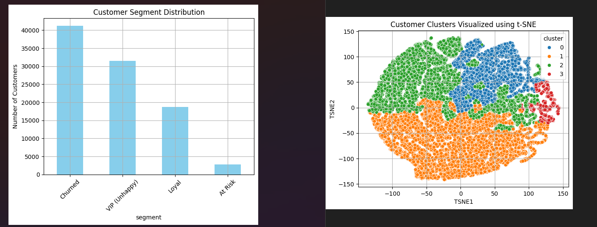
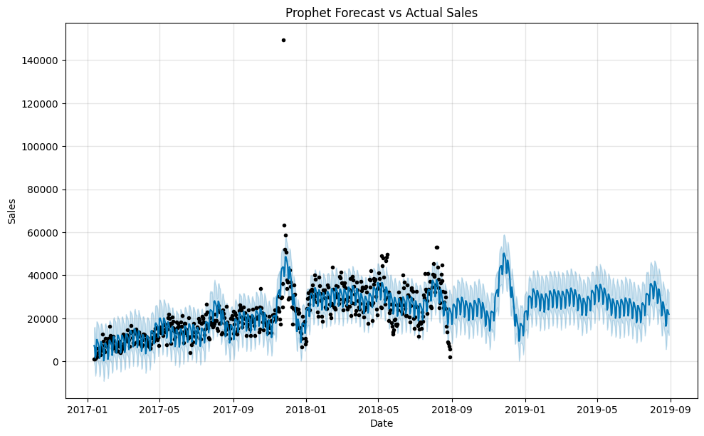

# 🛒 Brazilian Olist E-Commerce Analytics Platform

## 🚀 Project Overview
An end-to-end data science solution on the Olist Brazilian e-commerce dataset. It integrates multiple pipelines, ML models, and dashboards to generate insights for e-commerce platforms.

---

## 📷 Snapshots

### 1. Power BI Dashboard

### 2. Sentiment Analysis Web App (Flask UI)

### 3. Clustering Result Visualization

### 4. Sales Forecast Plot

---

## 🧠 Goals
- Customer sentiment analysis from reviews
- Forecast sales trends
- Predict delivery delays
- Understand customer buying behavior
- Dashboard for non-tech users

---

## 🔧 Tech Stack
| Area            | Tools |
|-----------------|-------|
| Programming     | Python, SQL |
| Data Processing | Pandas, Spark SQL |
| ML & DL         | Scikit-learn, Prophet, XGBoost, Hugging Face |
| Web App         | Flask |
| Dashboard       | Power BI |
| Deployment      | GitHub Actions, AWS, Azure |

---

## 📁 Dataset
Source: [Kaggle - Olist Dataset](https://www.kaggle.com/datasets/olistbr/brazilian-ecommerce)

---

## 👥 Contributors
- Udhav (You)
- [Mentor Name]
- [Team Members]

---

## 📌 Contact
📧 [Your Email]  
🔗 [LinkedIn Profile]

---

## 📎 License
MIT License
